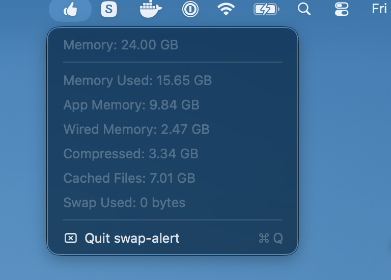

# swap-alert

A tiny macOS menu bar app that shows a **pulsating red orb** whenever the
system is using swap. When swap is idle, it sits quietly as a small dim dot.

Single Swift file, no Xcode project, no dependencies.



## Install

```sh
curl -fsSL https://raw.githubusercontent.com/dpeckham/swap-alert/main/install.sh | sh
```

This builds `swap-alert` from source, installs it to `~/.local/bin`, and
registers a LaunchAgent so it starts automatically at login. Requires the
Xcode command line tools (`xcode-select --install`).

A small dot will appear in your menu bar. Click it for current swap usage and
a Quit option. The dot turns into a pulsating red orb whenever
`sysctl vm.swapusage` reports `used > 0`.

To uninstall:

```sh
launchctl unload ~/Library/LaunchAgents/com.dpeckham.swap-alert.plist
rm ~/Library/LaunchAgents/com.dpeckham.swap-alert.plist ~/.local/bin/swap-alert
```

## Build manually

```sh
swiftc -O main.swift -o swap-alert -framework Cocoa
./swap-alert &
```

## License

[MIT](LICENSE)
